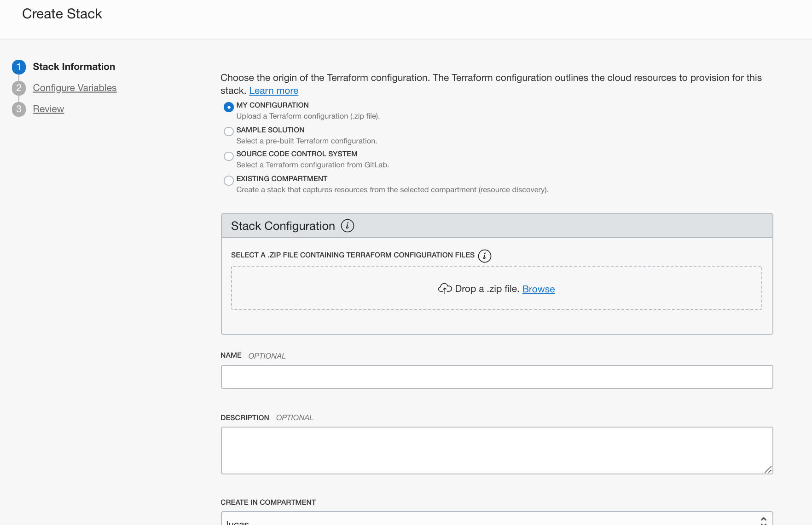

# oci-github-actions-runner

The [Oracle Cloud Infrastructure (OCI) Quick Start](https://github.com/oracle-quickstart?q=oci-quickstart) is a collection of examples that allow Oracle Cloud Infrastructure users to get a quick start deploying advanced infrastructure on OCI.

oci-github-actions-runner contains the Terraform template that can be used for deploying [GitHub Actions self-hosted Runners](https://docs.github.com/en/actions/hosting-your-own-runners/about-self-hosted-runners) that runs from local Terraform CLI, [OCI Resource Manager](https://docs.cloud.oracle.com/en-us/iaas/Content/ResourceManager/Concepts/resourcemanager.htm) and [OCI Cloud Shell](https://docs.cloud.oracle.com/en-us/iaas/Content/API/Concepts/cloudshellintro.htm). GitHub Actions self-hosted Runners can be associated with a GitHub repository, an organization or an enterprise.

The terraform template deploys GitHub Actions self-hosted Runners to an existing or brand new Virtual Cloud Network. The self-hosted Runner can run on Virtual Machine or Bare Metal instances is setup on top of Oracle Linux 8 platform image and enable you to run container based workflows. Please install additional tools as required by your project workflow.

This repo is under active development.  Building open source software is a community effort.  We're excited to engage with the community building this.

## Prerequisites

First off we'll need to do some pre deploy setup, that's all detailed [here](https://github.com/oracle/oci-quickstart-prerequisites).

In order to deploy GitHub Actions Runner you also need to provide the following information:
* URL of the GitHub repository/organization/enterprise
* automatically-generated time-limited token to authenticate the request***

More information on how to deploy GitHub Runners available [here](https://docs.github.com/en/actions/hosting-your-own-runners/adding-self-hosted-runners)

## Resource Manager Deployment

This Quick Start uses [OCI Resource Manager](https://docs.cloud.oracle.com/iaas/Content/ResourceManager/Concepts/resourcemanager.htm)(ORM) to make deployment quite easy. You can customize the code available on this repo and  `build` your own ORM Stack following the [Resource Manager instructions](https://docs.cloud.oracle.com/en-us/iaas/Content/ResourceManager/Tasks/managingstacksandjobs.htm#console) detailed in the sections below. Alternatively, click on the *[Deploy to Oracle Cloud](#Deploy)* button in the Deploy section of this page to automatically create your ORM Stack based on the [latest release](https://github.com/oracle-quickstart/oci-github-actions-runner/releases) published through this repo.

In case you want to build the Stack, make sure you have Terraform v0.14+ cli installed and accessible from your terminal.

```bash
terraform -v

Terraform v0.14.9
+ provider registry.terraform.io/hashicorp/oci v4.21.0
+ provider registry.terraform.io/hashicorp/template v2.2.0
```

### Build

In order to `build` the zip file with the latest changes you made to this code, you can simply go to [build-orm](./build-orm) folder and either run `build.sh` shell script or use terraform to generate a new zip file. In case you want to use Terraform, follow the instructions below:

At first time, you are required to initialize the terraform modules used by the template with  `terraform init` command:

```bash
$ Initializing the backend...

Initializing provider plugins...
- Reusing previous version of hashicorp/archive from the dependency lock file
- Installing hashicorp/archive v2.1.0...
- Installed hashicorp/archive v2.1.0 (signed by HashiCorp)

Terraform has been successfully initialized!
```

Once terraform is initialized, just run `terraform apply` to generate ORM zip file.

```bash
$ terraform apply

data.archive_file.generate_zip: Refreshing state...

Apply complete! Resources: 0 added, 0 changed, 0 destroyed.
```

This command will package the required content of `oci-github-actions-runner` folder into a zip and will store it in the `build-orm\dist` folder. You can check the content of the file by running `unzip -l dist/oci-github-actions-runner-orm.zip`:

```bash
$ unzip -l dist/oci-github-actions-runner-orm.zip       
Archive:  dist/oci-github-actions-runner-orm.zip
  Length      Date    Time    Name
---------  ---------- -----   ----
     1933  01-01-2049 00:00   .terraform.lock.hcl
     1698  01-01-2049 00:00   compute.tf
      119  01-01-2049 00:00   data_sources.tf
      927  01-01-2049 00:00   locals.tf
     2068  01-01-2049 00:00   network.tf
     2497  01-01-2049 00:00   nsg.tf
    15535  01-01-2049 00:00   orm.yaml
      743  01-01-2049 00:00   outputs.tf
     2679  01-01-2049 00:00   scripts/install-github-runner-OL.sh
     5755  01-01-2049 00:00   variables.tf
       46  01-01-2049 00:00   versions.tf
---------                     -------
    34000                     11 files
```

### Deploy

Adding a GitHub Actions self-hosted runner typically requires that you download, configure, and execute the GitHub Actions Runner. By deploying this Stack, you are downloading and configuring the GitHub Actions Runner, you agree to the [GitHub Terms of Service](https://docs.github.com/github/site-policy/github-terms-of-service) or [GitHub Corporate Terms of Service](https://docs.github.com/github/site-policy/github-corporate-terms-of-service), as applicable.

You can deploy the GitHub Actions self-hosted direct into your Oracle Cloud Infrastructure tenancy by clicking on [](https://console.us-phoenix-1.oraclecloud.com/resourcemanager/stacks/create?region=home&zipUrl=https://github.com/oracle-quickstart/oci-github-actions-runner/releases/download/orm-deploy/orm.zip). Alternativelly, you can deploy the zip file you previously generated based on the instructions below:

1. Click on [Create Stack](https://cloud.oracle.com/resourcemanager/stacks/create) to Oracle Cloud Infrastructure to import the zip file.
    > `Home > Developer Services > Resource Manager > Stacks > Create Stack`

2. Upload the `oci-github-actions-runner-orm.zip` and provide a name and description for the stack


3. Configure the Stack. The UI will present the variables to the user dynamically, based on their selections. These are the configuration options:

> GitHub Actions Runner Configuration

|          VARIABLE          |           DESCRIPTION                                                 |
|----------------------------|-----------------------------------------------------------------------|
|GITHUB URL|URL for the GitHub organization or repository in the format of `https://github.com/<github-organization>/<github-repo>/`|
|REGISTRATION TOKEN|The GitHub Actions Runner Registration token|
|NUMBER OF RUNNER INSTANCES|The total number of Compute instances to deploy|
|RUNNER LABEL LIST|LABELS associated with the Runner|
|RUNNER VERSION|Release version in the format of `n.nnn.n`. E.g. for release v2.278.0 you should use `2.278.0`. Releases: https://github.com/actions/runner/releases |


> Compute Configuration

|          VARIABLE          |           DESCRIPTION                                                 |
|----------------------------|-----------------------------------------------------------------------|
|COMPUTE COMPARTMENT         | Compartment for Compute resources|
|AVAILABILITY DOMAIN         | Availability Domain|
|INSTANCE NAME               | Compute instance name|
|DNS HOSTNAME LABEL          | DNS Hostname|
|COMPUTE SHAPE               | Compatible Compute shape|
|FLEX SHAPE OCPUS            | Number of OCPUs, only available for Flex compute shapes|
|FLEX SHAPE MEMORY           | Amount of memory, only available for Flex compute shapes|
|COMPUTE IMAGE STRATEGY      | Use either a `Platform Image` or `Custom Image`|
|PLATFORM IMAGE*             | When `PLATFORM IMAGE` is chosen, select a Platform Image form the list |
|CUSTOM IMAGE*               | When `CUSTOM IMAGE` is chosen, enter the Custom Image OCID (based on Oracle Linux 8.x) |
|PUBLIC SSH KEY              | RSA PUBLIC SSH key used for SSH to the OS|

> Virtual Cloud Network

|          VARIABLE          |           DESCRIPTION                                                 |
|----------------------------|-----------------------------------------------------------------------|
|NETWORK COMPARTMENT         | Compartment for all Virtual Cloud Nettwork resources|
|NETWORK STRATEGY            | `Create New VCN and Subnet`: Create new network resources during apply. <br> `Use Existing VCN and Subnet`: Let user select pre-existent network resources.|
|CONFIGURATION STRATEGY      | `Use Recommended Configuration`: Use default configuration defined by the Terraform template. <br> `Customize Network Configuration`: Allow user to customize some network configuration such as name, dns label, cidr block for VCN and Subnet.|

> Virtual Cloud Network - Customize Network Configuration

|          VARIABLE          |           DESCRIPTION                                                 |
|----------------------------|-----------------------------------------------------------------------|
|NAME                        | VCN Display Name|
|DNS LABEL                   | VCN DNS LABEL|
|CIDR BLOCK                  | The CIDR of the new Virtual Cloud Network (VCN). If you plan to peer this VCN with another VCN, the VCNs must not have overlapping CIDRs.|

> Subnet (visible when `Customize Network Configuration` is selected or `Use Existing VCN and Subnet`)

|          VARIABLE          |           DESCRIPTION                                                 |
|----------------------------|-----------------------------------------------------------------------|
|SUBNET TYPE                 | `Public Subnet` or `Private Subnet`|
|EXISTING SUBNET*            | Visible when `Use Existing VCN and Subnet` selected. List of Subnets available on the selected VCN based on the Subnet Type|
|NAME                        | Subnet Display Name|
|DNS LABEL                   | Subnet DNS LABEL|
|CIDR BLOCK                  | The CIDR of the Subnet. Should not overlap with any other subnet CIDRs|
|NETWORK SECURITY GROUP CONFIGURATION| `Use Recommended Configuration`: Use default configuration defined by the Terraform template. <br> `Customize Network Security Group`: Allow user to customize some basic network security group settings.|

> Network Security Group (visible only when `Customize Network Security Group` is selected)

|          VARIABLE          |           DESCRIPTION                                                 |
|----------------------------|-----------------------------------------------------------------------|
|NAME                        | NSG Display Name|
|ALLOWED INGRESS TRAFFIC (CIDR BLOCK)| WHITELISTED CIDR BLOCK for ingress traffic|
|SSH PORT NUMBER             | Default SSH PORT for ingress traffic|
|HTTP PORT NUMBER            | Default HTTP PORT for ingress traffic|
|HTTPS PORT NUMBER           | Default HTTPS PORT for ingress traffic|

> Additional Configuration Options

|          VARIABLE          |           DESCRIPTION                                                 |
|----------------------------|-----------------------------------------------------------------------|
|TAG KEY NAME                | Free-form tag key name|
|TAG VALUE                   | Free-form tag value|

4. Click Next and Review the configuration.
5. Click Create button to confirm and create your ORM Stack.
6. On Stack Details page, you can now run `Terraform` commands to manage your infrastructure. You typically start with a `plan` then run `apply` to create and make changes to the infrastructure. More details below:

|      TERRAFORM ACTIONS     |           DESCRIPTION                                                 |
|----------------------------|-----------------------------------------------------------------------|
|Plan                        | `terraform plan` is used to create an execution plan. This command is a convenient way to check the execution plan prior to make any changes to the infrastructure resources.|
|Apply                       | `terraform apply` is used to apply the changes required to reach the desired state of the configuration described by the template.|
|Destroy                     | `terraform destroy` is used to destroy the Terraform-managed infrastructure.|
